# 📊 LLM Inference Benchmark Dashboard

Dashboard de comparaison de moteurs d'inférence LLM — développé dans le cadre du PFE
2025–2026 chez **Talan Tunisie**, en complément du projet **Adaptive LLM Router**.

🔗 **Démo en direct :** https://splendid-mochi-a31921.netlify.app

---

## 🎯 Objectif du projet

Choisir un moteur d'inférence LLM (Ollama, vLLM, TGI, TensorRT-LLM...) ne devrait pas être un
pari. Ce dashboard rassemble dans une seule interface :

- des **mesures réelles**, obtenues en local sur nos machines (Ollama sur GPU, llama.cpp sur CPU) ;
- des **chiffres de référence publics**, issus de la documentation officielle des moteurs
  qu'on n'a pas pu tester en local faute de GPU compatible (vLLM, TensorRT-LLM, SGLang, TGI, LMDeploy) ;

pour permettre de **comparer, analyser et choisir** le moteur le plus adapté à un contexte
donné (matériel disponible, objectif, écosystème).

⚠️ **Transparence méthodologique** : chaque page distingue clairement ce qui est `Mesuré`
localement de ce qui est `Public` / documenté. Les deux catégories ne sont **pas comparées
dans les mêmes conditions matérielles** (GPU dédié vs A100 80GB en datacenter) — voir la
page *Nos Expérimentations* pour le détail.

---

## 🖼️ Aperçu de l'application

### 1. Overview — vue d'ensemble
Page d'accueil : indicateurs clés (moteurs comparés, meilleur débit mesuré/documenté,
latence moyenne, usage GPU), graphique comparatif multi-moteurs et assistant IA en aperçu.

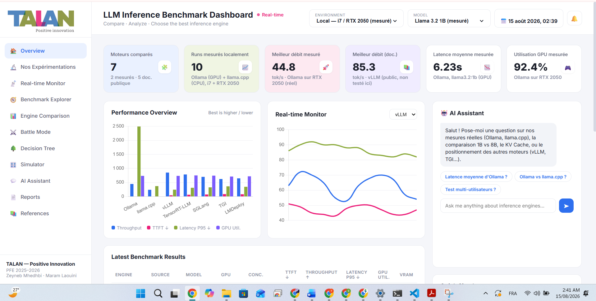

### 2. Nos Expérimentations — mesures réelles
Détail des runs mesurés localement : Ollama (GPU, RTX 2050) vs llama.cpp (CPU uniquement).
Chaque graphique affiche la latence et le débit run par run, avec les moyennes et les
avertissements sur les runs instables.

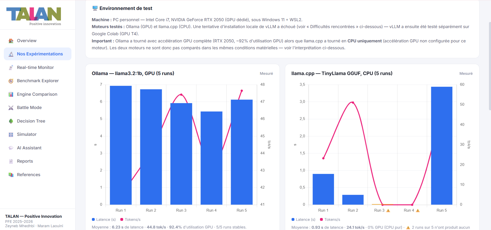

### 3. Real-time Monitor
Suivi en direct (simulé à partir des mesures réelles) des tokens/sec, requêtes/sec et
utilisation GPU pour le moteur sélectionné.

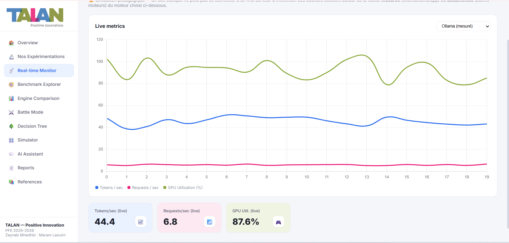

### 4. Benchmark Explorer
Table filtrable et triable de tous les runs (mesurés + publics) avec TTFT, débit, latence
P95, utilisation GPU et VRAM.

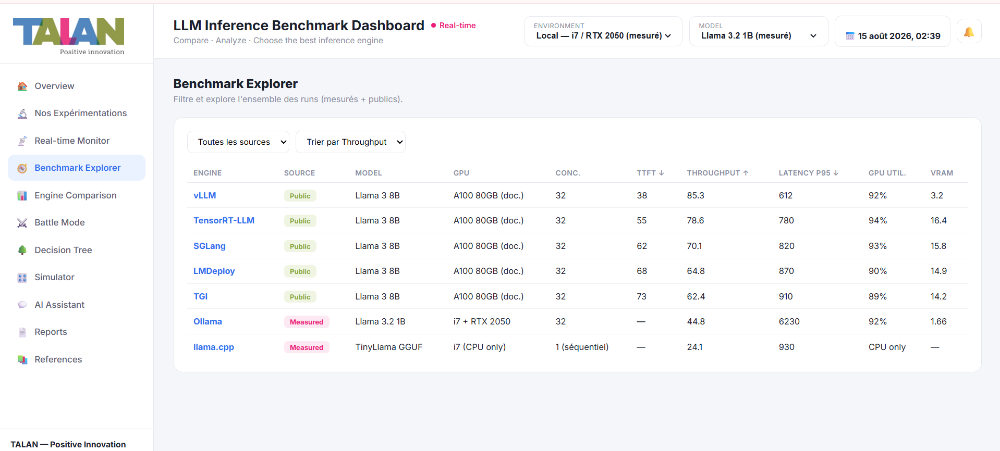

### 5. Engine Comparison
Radar chart pour superposer jusqu'à 3 moteurs sur plusieurs axes (perf IA, hardware,
polyvalence...), avec une fiche descriptive par moteur sélectionné.

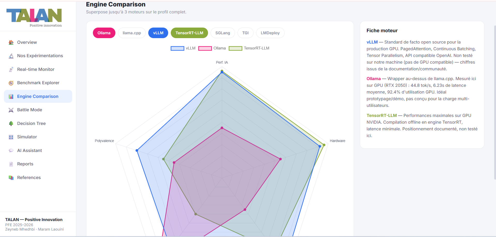

### 6. Battle Mode
Confrontation directe de deux moteurs sur leur débit.

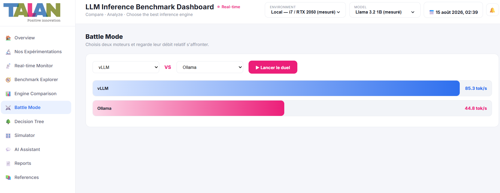

### 7. Decision Tree
Trois questions (matériel, objectif, écosystème) pour obtenir une recommandation de moteur
argumentée.

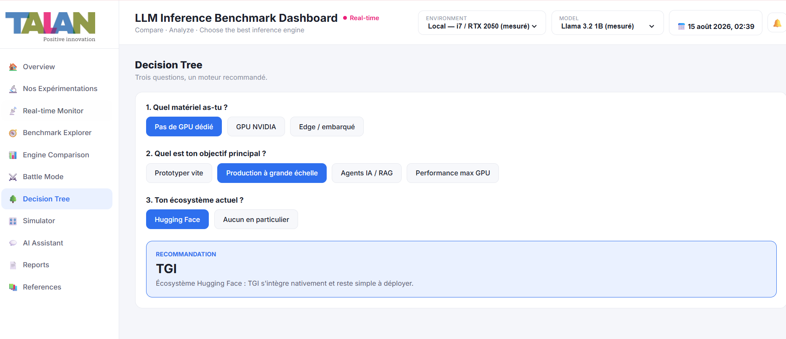

### 8. Simulator
Estimateur de performance : projette débit, TTFT, utilisation GPU et VRAM selon le moteur,
la taille du modèle, le GPU et le niveau de concurrence choisis — à partir de formules
calibrées sur les mesures réelles et les benchmarks publics.

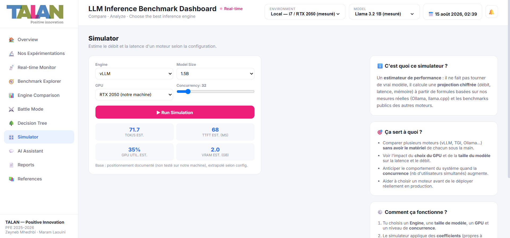

### 9. AI Assistant
Assistant conversationnel pour interroger les résultats : comparaison 1B vs 8B, KV Cache,
positionnement des différents moteurs, etc.

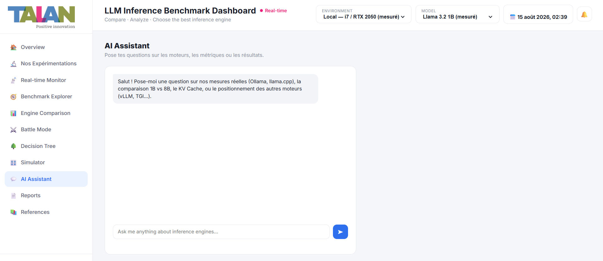

### 10. Reports
Documents de l'étude prêts à télécharger : cours complet, étude d'expérimentation,
version condensée, slides de présentation.

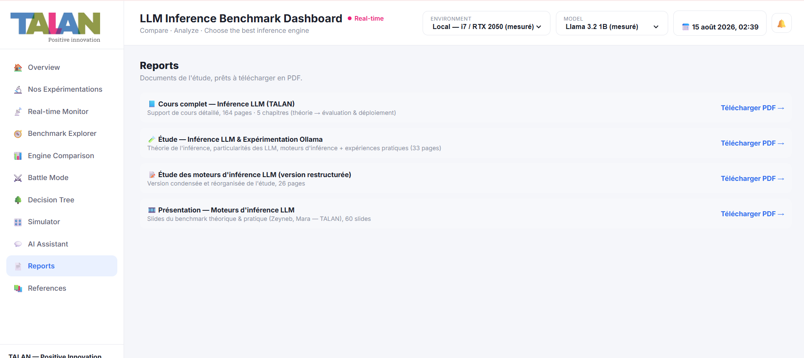

### 11–12. References
Sources et documentation officielle de chaque moteur, plus une liste de projets GitHub pour
prolonger le benchmarking (vLLM Nightly Benchmarks, GuideLLM, LLMPerf, Awesome-LLM-Inference-Engine...).

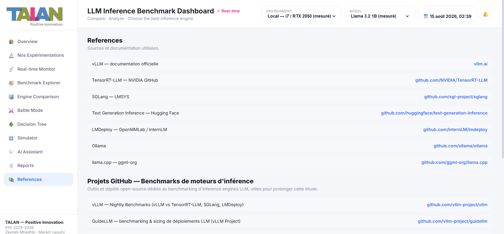
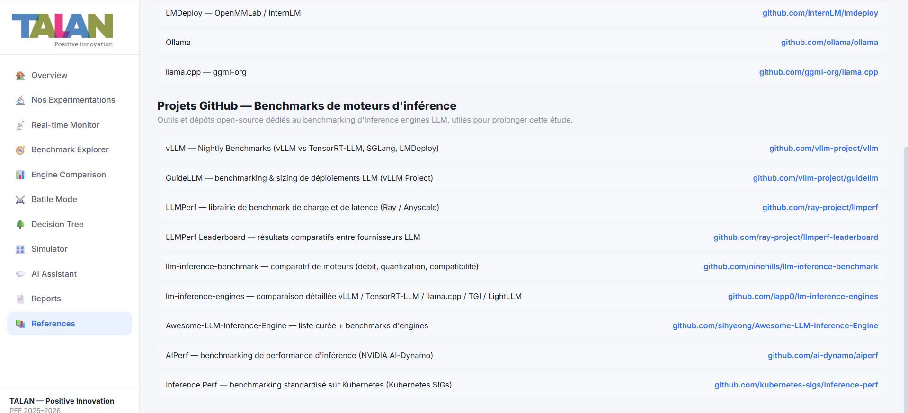

---

## 🧩 Architecture de l'application

Fichier unique, aucune API backend : toutes les données (mesures locales + chiffres publics)
sont embarquées dans le JS, et chaque page est une simple vue filtrée/dérivée du même jeu de
données.

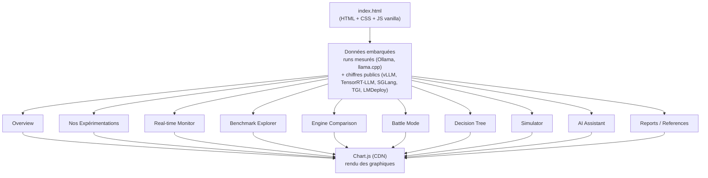

**Environnement de test réel** : PC personnel — Intel Core i7, NVIDIA GeForce RTX 2050
(GPU dédié), Windows 11 + WSL2. Ollama a tourné avec accélération GPU complète (~92%
d'utilisation), llama.cpp en CPU uniquement (pas d'accélération GPU configurée pour ce
moteur) — d'où la distinction stricte entre données `Mesuré` et données `Public` dans
toute l'app.

---

## ✨ Fonctionnalités principales

| Page | Rôle |
|---|---|
| **Overview** | Indicateurs clés + graphique comparatif global |
| **Nos Expérimentations** | Détail des runs mesurés localement (Ollama GPU / llama.cpp CPU) |
| **Real-time Monitor** | Suivi live des métriques du moteur sélectionné |
| **Benchmark Explorer** | Table complète, filtrable et triable, de tous les runs |
| **Engine Comparison** | Radar chart pour comparer jusqu'à 3 moteurs |
| **Battle Mode** | Duel direct entre deux moteurs sur le débit |
| **Decision Tree** | Recommandation de moteur en 3 questions |
| **Simulator** | Estimation débit/latence/VRAM selon config (moteur, modèle, GPU, concurrence) |
| **AI Assistant** | Q&A sur les résultats de benchmark |
| **Reports / References** | Documents téléchargeables et sources |

---

## 🛠️ Stack technique

Fichier unique `index.html` — HTML/CSS/JS vanilla, graphiques via
[Chart.js](https://www.chartjs.org/) (CDN), police Inter (Google Fonts).
Aucune étape de build : le site se déploie tel quel.

## ▶️ Lancer en local

Aucune dépendance à installer — ouvre simplement `index.html` dans un navigateur,
ou sers-le avec un petit serveur statique :

```bash
npx serve .
```

## 🚀 Déployer

Déployé actuellement sur Netlify (glisser-déposer du dossier, ou lié à ce dépôt Git avec
`index.html` à la racine comme point d'entrée — aucune commande de build à configurer).

## 👥 Auteurs

Zeyneb Mhedhbi · Maram Laouini — PFE 2025–2026, Talan Tunisie
